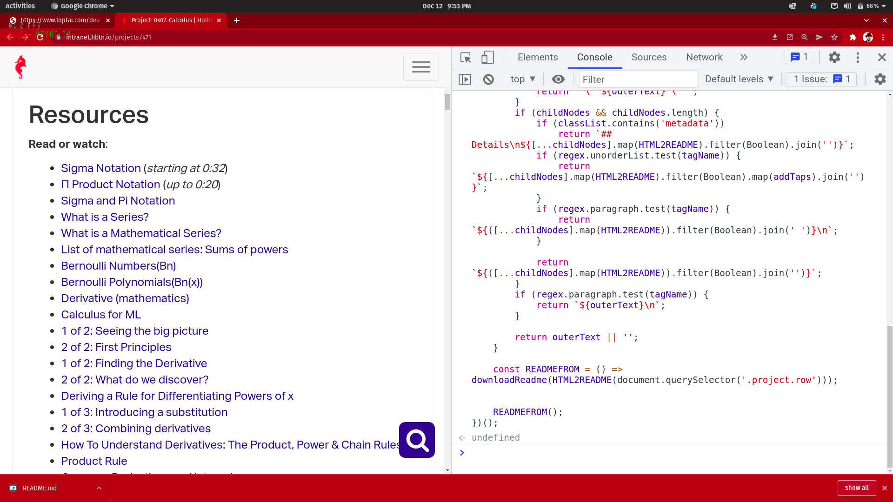

# 📚 Descargar README desde la Intranet de Holberton

Este proyecto te permite descargar el archivo README del proyecto en el que te encuentres en la Intranet de Holberton. Simplemente pega este código en tu consola y al ejecutarlo, al presionar "Enter", se descargará automáticamente el README del proyecto.

## ℹ️ Cómo funciona

1. Abre el proyecto en la Intranet de Holberton.
2. Abre la consola del navegador (puedes usar la combinación de teclas `Ctrl + Shift + J` o `Cmd + Option + J` en la mayoría de los navegadores).
3. Copia y pega el código proporcionado [aqui](https://github.com/JuanDAC/browser-project-holberton-to-readme/blob/main/src/index.js) en la consola.
4. Presiona la tecla "Enter".
5. ¡El archivo README.md se descargará automáticamente en tu dispositivo!

## 🐞 Reportar problemas

Si encuentras algún problema o error al utilizar este código, por favor, reporta un "issue" en el repositorio de GitHub asociado a este proyecto. Puedes acceder al repositorio [aquí](https://github.com/JuanDAC/browser-project-holberton-to-readme/issues).

## ⭐ Agradecimiento

Si encuentras útil este proyecto, ¡no dudes en dejar una estrella en el repositorio de GitHub! Tu apoyo es muy apreciado.

¡Esperamos que este código te sea de utilidad! 😊🚀

